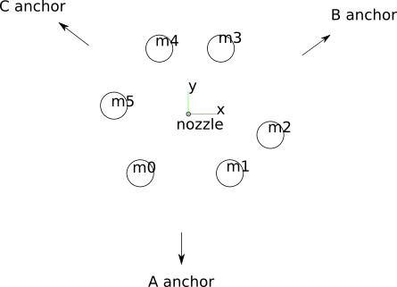

# hp-mark 

Measure Hangprinter externally

Current Hangprinters can only measure their own motor positions.
This is useful, but limited.
hp-mark is a separate solution for measuring a Hangprinter's
positions and orientations of anchors and effector.

# High-Level User-Story Dream
 1. Mount a computer-connected camera
 2. Point camera towards build area
 3. BAM! Hangprinter calibrates itself, and gets ready to start printing with fantastic accuracy & reliability

That user experience might be impossible to achieve, but let's get as close as we can.

# Use Cases by Priority
 0. Establish a coordinate system, with z-axis normal to the build plate
 1. The effector as a measurement device: Measure the effector's position and orientation
 2. Calibrate perfect anchor positions
 3. Measure Hangprinter's positional precision and accuracy
 4. Improve accuracy with static compensation matrix
 5. Detect print disasters
 6. Improve precision by dynamically compensating for measured errors

Comment on use case 2: By combining effector position data with the [auto-calibration-simulation-for-hangprinter](https://gitlab.com/tobben/auto-calibration-simulation-for-hangprinter/-/tree/hp_mark_adjusted), we might find perfect anchor positions without having the anchors in-image.

# History, as of Mar 31, 2021
This project was all about getting good pose estimations, for the first 6 months.
hp-mark was developed as a separate measurement system, with no Hangprinter-specific code or hardware.

We have now started manually executing Hangprinter use cases, like homing and anchor calibration.
See <a href="https://www.youtube.com/watch?v=o8oXp44mtUU">demo 0</a>,
<a href="https://www.youtube.com/watch?v=m9qjuZQowCE">demo 1</a>, and
<a href="https://www.youtube.com/watch?v=yRF-zevGHlQ">demo 2</a>, and
<a href="https://youtu.be/As3Y5J2NTGA">demo 3</a>.

Ahead of us now, is automating it more.

# Status
We can estimate poses with one camera, stably and reliably. [Tweet](https://twitter.com/tobbelobb/status/1377256553665990659).

 - [x] Acquire hardware
 - [x] Calibrate camera
 - [x] Acquire training/benchmark images
 - [x] Calculate one 3D point from one marker
 - [x] Calculate _n_ single points from _n_ markers
 - [x] Calculate 6D pose from 6 points (solve perspective-6-point, or P6P problem)
 - [x] Acquire camera 6D pose (this includes defining our world coordinate system)
 - [x] Acquire effector 6D pose
 - [x] Detect all markers on 95% of training images
 - [x] Create a continuous stream of position measurements (video?)
 - [x] Get a statistical idea about size of error at the origin
 - [ ] Respond to RepRapFirmware/Duet request for position measurement

A checked box above means "good enough for now".

Nice-to-haves:

 - [ ] Take image ourselves upon request, don't rely on other programs to take image first
 - [ ] Get a statistical idea about size of precision and accuracy in the whole measurement volume
 - [ ] Integrate a second camera, to reduce error


# Equipment
 - Raspberry Pi 4 (mine is Model B, 2GB RAM)
 - Arducam 8 MP Sony IMX219 camera module
 - Lens: M2504ZH05 Arducam lens
 - 32GB U3 SD card
 - Default recommended Raspberry Pi OS, 32-bit
 - OpenCV 4.4.0
 - EDLib for ellipse detection
 - Probably a separate computer ("desktop" or "laptop" or "main computer") for running hpm. You can run hpm directly on the Raspberry Pi, but it's slow.

# How To Clone/Pull This Repository

 - Clone with `git clone --recursive https://gitlab.com/tobben/hp-mark.git`. The `--recursive` is there to make sure you get the `hpm` submodule.
 - If you already did `git clone` without `--recursive`, do `git submodule init && git submodule update` to get submodule code right.
 - When you pull the hp-mark repo, since the `hpm` submodule might also have changed since last time, do either one of
   ```
   git pull; cd hpm; git pull; cd ..
   ```
   or
   ```
   git pull --recurse-submodules
   ```

# How To Use This Repository

First calibrate your camera.
How to do that is described in [the README.md in camera-calibration directory](./camera-calibration/README.md).

Then compile `hpm`.

# hpm
hpm is the core part of hp-mark.
It is a program that reads data from the camera, and outputs a pose (three rotational values, three translational values).

## hpm Dependencies
This repo will (for now) assume that a number of dependencies are already installed by the user.

#### Main Computer
 - OpenCV 4.2.0 or later
 - g++ version 10 or later
 - build2 version 0.13.0 or later (not required if you're only going to build once)
 - clang++ version 10 or later (not required for build & use)
 - clang-tidy version 10 or later (not required for build & use)
 - clang-format version 10 or later (not required for build & use)
 - compiledb (not required for build & use)
 - shfmt (not required for build & use)
 - python3 (not required for build & use)
 - black (not required for build & use)
 - scipy (not required for build & use)
 - numpy (not required for build & use)

#### Raspberry Pi 4
 - raspistill (shading fix required if you don't use standard Raspberry Pi Picam. For why, and how to get the right shading fixes for Arducam lenses see [here](https://www.arducam.com/docs/cameras-for-raspberry-pi/native-raspberry-pi-cameras/lens-shading-calibration/).)

### Why Are Some Dependencies Not Required for hpm Build & Use?
Scripts `tidy.sh`, `make-compilation-database.sh`, `format.sh` etc are there to softly enforce some coding quality and standards.
It you're not going to change the code anyways, then you don't need the scripts nor their dependencies.

### Why Is build2 Not Required Always?
build2 is a fast build system, but it takes a while to get it.
If you only need to build once, you can build without any build system, and use the script `hpm/hpm/slow_build.sh` instead.

It will be a very slow build, but it will take less time than it would have taken
to acquire build2.

## hpm How To Build
First, you need a fairly recent version of OpenCV installed somewhere in your C++ compilers' search path.

If you're on Ubuntu 20.04,
see <href="./doc/simplest-hpm-compilation-ubuntu-20.04">simplest-hpm-compilation-ubuntu-20.04</a>

If you're on another system, see OpenCV's or your operating system's official build/install instructions.

### For Users Who Only Build Once
```
cd hp-mark/hpm/hpm
./slow_build.sh --no-tests
```

It will tell you how it wants to be used.
I'm not using it directly most of the time.
Rather, I'm using it via the scripts found in
the  hp-mark/use directory

### For An Advanced User Who Wants To Build Repeatedly
Build with build2. See <a href="https://build2.org">build2.org</a> for install instructions.

Before building `hpm` with build2, its recommended to create a build configuration.
No pre-configured build configuration is shipped with this project, and build2's default configuration works poorly with hpm.

```
cd <path-to>/hp-mark/hpm
bdep init --config-create ../my-build-dir @user cc config.cxx=g++-10
```
This creates a build2 config, gives it the location `../my-build-dir`, the name `@user`, and the compiler `g++-10`.
Compile with
```
b
```

### If You're a Developer Making a Pull Request
Create a configuration with some more compiler flags than the user:
```
cd <path-to>/hp-mark/hpm
#in < path - to > / hp - mark / hpm
bdep init --config-create ../my-advanced-config @developer cc config.cxx=g++-10 config.cxx.coptions="-g -Wall -Wextra -Wold-style-cast -Wnon-virtual-dtor -pedantic -Wcast-align -Wunused -Woverloaded-virtual -Wpedantic -Wconversion -Wsign-conversion -Wmisleading-indentation -Wnull-dereference -Wdouble-promotion -Werror -O2 -march=native"
```
You can edit your personal or compiler specific flags later, in `<path-to>/hp-mark/my-advanced-config/build/config.build`.
Some example flags for reference can be seen in `<path-to>/hp-mark/hpm-gcc/build/config.build`.

Compile with
```
b test
```
which will build and test using your default build config.

Symlinks to executables end up in `<path-to>/hp-mark/hpm/hpm/`.
The executables themselves, as well as build artifacts, end up in `../my-build-dir/hpm/hpm/` or `../my-advanced-config/hpm/hpm/`, depending on which build you updated.

Create as many configs as you want.
One that cross compiles for the Raspberry Pi 4 might be particularly useful in the later stages of this project, when build times get noticeable.

You can see all your configs, and which of them is the default with
```
bdep config list
```
bdep is a very flexible and useful command. See its documentation [here](https://build2.org/bdep/doc/bdep-config.xhtml).

I use [some own notes](https://gitlab.com/hangprinter/linc/-/blob/master/README.md) for remembering build2 commands.


## How To Run
Your executable should tell you how it wants to be used.
Ask it like this:
```
<path-to>/hp-mark/hpm/hpm/hpm
```
or, like this:
```
cd <path-to>/hp-mark/hpm/hpm/
./hpm
```

The executable will tell you that it wants some camera parameters (a config file).
Examples of camera parameter configs are given in `hp-mark/hpm/hpm/example-cam-params/`.
They contain the outputs of your camera calibration, as well as `camera-rotation` and
`camera-translation` that are created by `hpm` itself, if it's executed with the `-c/--camera-position-calibration` flag.

To get the correct `camera-rotation` and `camera-translation`:

 1. Place your effector at home position (nozzle in origin, lines tight, effector horizontal).
 2. Mount your camera in it's final position, pointing towards the effector.
 3. Take the image (and maybe download to your main computer, if that's where you execute `hpm`).
 4. Run `$ ./hpm <your-half-finished-camera-parameters-file> <marker-parameters> <image-file> --camera-calibration`

### But Wait, We Don't Have The Correct Marker Parameters Yet!
True. Marker parameters is another config file, that describes your markers.
Examples of such configs are found in `hp-mark/hpm/hpm/example-marker-params/`.
They contain:

 * Maker positions
 * Marker type
 * Marker size
 * A topleft marker center value that's unused for now

Your marker type is most probably disk, but hpm also supports sphere.
Your marker diameter is 90 mm if you follow my standard example. Bigger is generally better.
Your marker positions are a bit more complicated.
We want their xyz positions relative to the tip of the nozzle, in a coordinate system that looks like this:





It's very hard to take these xyz measurements directly, so I've made a little script that lets you
take easier measurements, and find the correct xyz positions based on the easier measurements.

So, there will be 21 measurements.
They are all either between the center of a marker to the tip of the nozzle,
or between two centers of markers.
Referring to the image, Make the following measurements in the following order:

 * nozzle-m0, nozzle-m1, nozzle-m2, nozzle-m3, nozzle-m4, nozzle-m5
 * m0-m1, m0-m2, m0-m3, m0-m4, m0-m5,
 * m1-m2, m1-m3, m1-m4, m1-m5,
 * m2-m3, m2-m4, m2-m5,
 * m3-m4, m3-m5,
 * m4-m5.

Armed with these 21 values (in units of millimeters), do
```
cd hp-mark/find-marker-positions
./find-marker-positions.py --measurements <all measurements here in correct order, separated by spaces>
```
Alternatively, you can type in your 21 values into the `find-marker-positions.py` script directly. It's near the bottom of the file.
I you do type in directly into the file, you can execute the script with no arguments:
```
./find-marker-positions.py
```

If you get a cost below ca 3, you're probably good.
Copy/paste the final values you get into your marker-params config file.

Congrats! You should now be able to measure the position of your effector with hp-mark.
Take a few test images and see if it works.

After a while, it gets cumbersome to always have to download the image from the Raspberry Pi to the main computer manually,
so I've written some scripts to speed that up.

Look into:

```
<path-to>/hp-mark/use/use_ssh_continuous.sh
```

Open it, change `CAMPARAMS` and `MARKERPARAMS` variables so they point to your two new config files.
It accepts the same flags as `hpm` does, so take it for a ride for example like
```
./use_ssh_continuous.sh --show result
```
... and press Enter to get another image, or ctrl-C to exit.

Another important script, which also tries to move the Hangprinter's effector around between images is called
`get_auto_calibration_data_automatically.sh`.
I won't get into detail about that here. Some detail is offered in the hangprinter.org docs.


# Remaining Development Challenges
 - The cameras' positions are estimated from images of known patterns. The results' accuracy are limited by errors in the markers and errors in the camera calibration values
 - We must calibrate the camera lens to compensate for optical distortion. This is time consuming and hard. The lo-distortion lens from Arducam helps a bit, but not all
   the way.

# Opportunities & Smaller Use Cases
 - There's an interesting PnP solver on its way into OpenCV that seems very good: [Added SQPnP algorithm to SolvePnP (2020)](https://github.com/opencv/opencv/pull/18371)
 - Distances between nozzle and markers may be measured by placing the nozzle on a marker, and letting hp-mark measure relative distances.
 - We can add features in the future that control the image processor (to compensate distortion predictably, or for other tasks). An image processor can do [lots of things](https://webpages.uncc.edu/jfan/isp.pdf). The Raspberry pi 4 and libcamera gives us the perfect tools for the job:
   * [raspberrypi.org page about libcamera](https://www.raspberrypi.org/documentation/linux/software/libcamera/)
   * [libcamera's own home page](http://www.libcamera.org/)
   * [Blog post announcing libcamera](https://www.raspberrypi.org/blog/an-open-source-camera-stack-for-raspberry-pi-using-libcamera/)

# Keywords
 camera localization, pose estimation, motion tracking, optical sensors, vision-based registration, marker-based tracking techniques, fiducial marker localization
