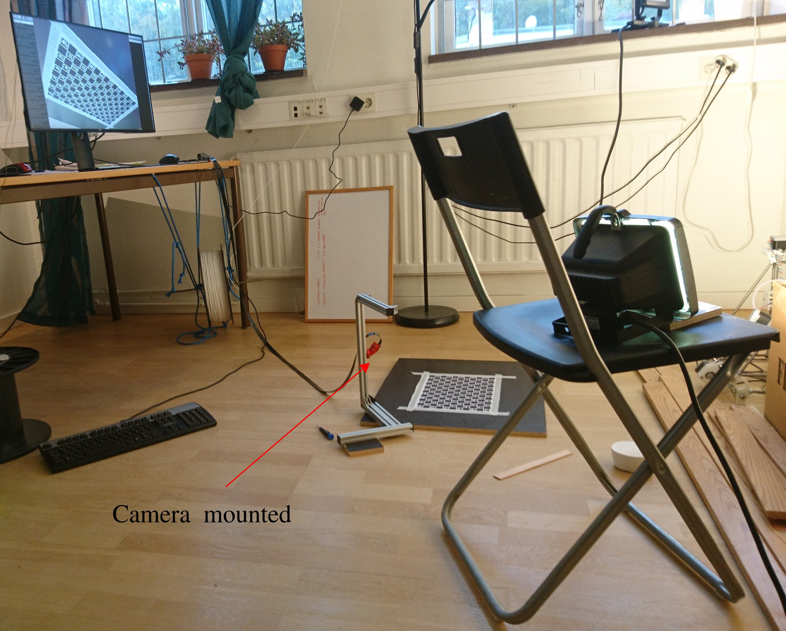
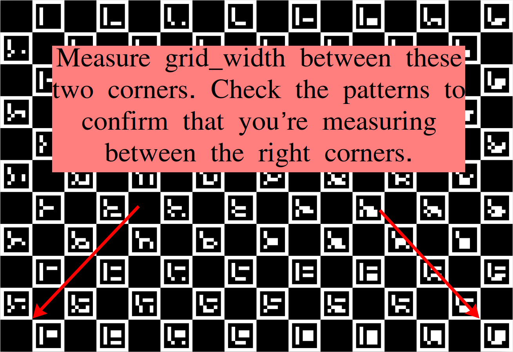

# How To Calibrate PiCam v2 for HP Mark

We're going to use a [charuco board](https://docs.opencv.org/4.4.0/da/d13/tutorial_aruco_calibration.html)
as our pattern.

We're also going to use [a non-linear optimization method](https://elib.dlr.de/71888/1/strobl_2011iccv.pdf)
to compensate for the paper with the charuco board on being every so slightly non-flat.

## Preparations

Read this whole document first.
You might want to do things in a different order than described here,
so read the whole document first to avoid time consuming surprises later.
You can always come back here and follow step-by-step later.

Print the charuco board pdf as large as you can.
Tape/glue your charuco board down as flat and straight as possible.

Compile and take the camera calibration program for a test run:
(Warning: this takes a few minutes to run on the Raspberry pi 4.)
```
cd <path-to>/hp-mark/camera-calibration
./doit.sh
```

If everything went smooth, an output file `myCamParams.xml` should have been created.
It contains nonsense, but we hopefully confirmed that the compiler and the program itself are working.

Next remove it and the test images.
(Take a look at them first, they should be decent examples.)

```
rm myCamParams.xml pics/camera*
```

## How To Take Calibration Images

Take your own pics inside the pics directory.
```
cd pics
./takeCalibrationStills.sh
```
Press Enter to take a picture, press X followed by enter before the last image.

Regardless if your first pics are good or bad, put their names in the `pics_list.xml`, and
execute `doit.sh` like before.
You will probably get an error the first time, because all the corners could not be identified in
some, or all of your image(s).

Look into the script `takeCalibrationStills.sh` and adjust each of the flags to `raspistill`
until you get nice image quality.

Take note of the `-fs/--framestart` flag.
Increment the framestart if you want to avoid overwriting previously taken images.

We want to not have over-exposure, as it would affect calibration negatively.
Reduce the `--shutter` time until the white squares look light grey on your image.

Also, adjust the focus of your Picam v2.
Optimize for the distance range of the final use case, not for the calibration itself.
If you later change the focus, you will need to re-calibrate the camera.

## How To Take Good Calibration Images

Read [Dr. Strobl's invaluable calibration hints](https://www.dlr.de/rm/en/desktopdefault.aspx/tabid-3925/6084_read-9196/).
Here's a procedure that tries to take the advice into account as much as we can in our use case:

  * Fasten your Picam to a camera tripod or similar, at 25-27 cm height
  * Move the camera around the pattern and take images
  * Fill as large portion of the image with squares as you can
  * All aruco markers must be in every image
  * Don't touch or move the pattern between images
  * Take half of the images with the camera mounted upside down (otherwise we risk getting better calibration in the upper half of the image, where focus is sharper)

Here's an image of my "imaging lab" during calibration image grab.




## How To Use the Calibration Images Well

Run `./doit.sh` to double check that all corners of all images in `pics_list.xml` are detected.
You might get better detection my incrementing/decrementing `adaptiveThreshWinSizeStep` inside `detector_params.yml` by 1 or 2.
There's [a whole tutorial](https://docs.opencv.org/4.4.0/d5/dae/tutorial_aruco_detection.html) about Aruco detection in the OpenCV documentation.

Once you have 10-20 good images with full corner detection in your `pics_list.xml`, it's time to do some final tuning.

Measure the square side length of your charuco board as accuratly as you can.
If your paper is even slightly wrinkled, remember that each square will appear shortened by that if you measure across several squares at once.
We don't want to include the losses from paper wrinkling in our measurement, we want the real width of a stretched square.
Also, squares will have different widths on different portions of your paper (unless your printer is really high-end),
so measure several times on different parts of the paper, and use the average of your measured values.

In a similar fashion, measure the side lengths of the aruco markers.
Getting the aruco size really accurate is less important than getting the square size right.
Focus your effort on the square size.

Open `doit.sh` and feed in your measured `--square_side_length` and `--marker_side_length`.
It doesn't matter which units you use.

The last value we need is the `--grid_width`:



In the grid width measurement, we do want the effects of paper wrinkling to be included in the measurement.
So you want a slightly lower value than `14 x square_side_length`.

The algorithm will try to understand how wrinkled your paper is, as described in [this paper](https://elib.dlr.de/71888/1/strobl_2011iccv.pdf).

Once the right `grid_width` is inserted into `doit.sh` it's time for the final calibration.
One last time, run:
```
./doit.sh
```
If everything went smooth, you'll get a small reprojection error.
I don't really know how small this value needs to be, but I would consider anything below 0.3 a success.

An output file `myCamParams.xml` should have been created.
It should now contain the intrinsic parameters for your PiCam v2.
